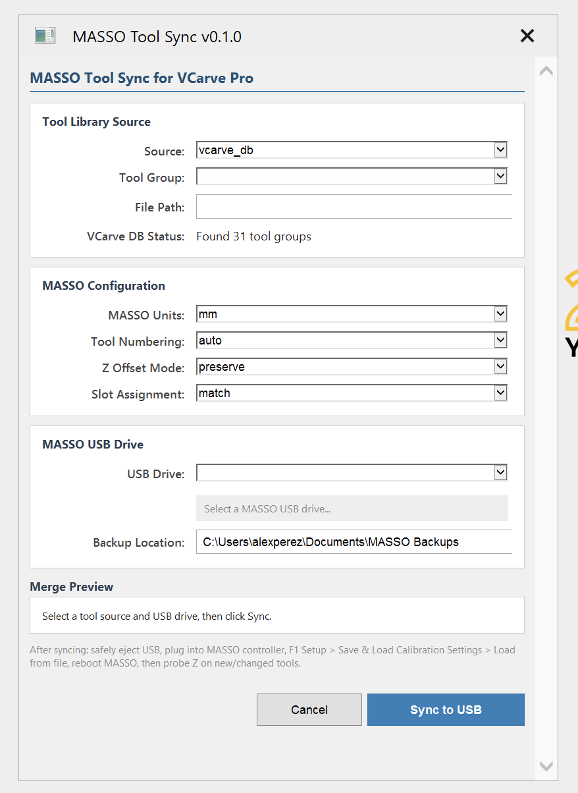

# MASSO Tool Sync for VCarve Pro

**VCarve Pro gadget that syncs tool libraries to your MASSO G3 CNC controller's USB drive.**

Version 0.1.0



## Features

- **One-click sync** from VCarve Pro tool database to MASSO G3 `.htg` tool table files
- **Multiple source formats** — reads from VCarve tool database, Fusion 360 library files (`.tools`/`.json`), or CSV files
- **Direct USB write** — select your MASSO USB drive and the gadget writes the tool table in place
- **Automatic backups** — zips the existing Machine Settings folder before every write
- **Auto-detect firmware** — finds the correct `.htg` filename on the USB automatically
- **Merge preview** — see exactly what will change before committing
- **Smart merge** — preserves Z offsets from probed tools, detects added/updated/replaced/unchanged tools
- **Auto tool numbering** — assigns sequential T1-T100 numbers (MASSO's max; T101-T104 are reserved for multi-spindle heads)
- **Unit conversion** — automatically converts between inch and metric tool libraries
- **Slot assignment** — configurable: match tool number or leave unassigned
- **Z offset modes** — zero all, preserve existing, or use tool body length
- **Pure Lua** — no external dependencies beyond VCarve's built-in Lua environment

## Requirements

- VCarve Pro (V10 or later recommended)
- MASSO G3 controller with v4.x or v5.x firmware
- USB drive with `MASSO/Machine Settings/` folder (created by the controller)
- For VCarve tool database reading: `sqlite3.exe` on PATH or in gadget's `resources/` folder

## Installation

### Automatic Installer (Recommended)

From the repository root (on Windows inside the Parallels VM, or a native
Windows machine):

**Double-click:** `install-vcarve.bat`

Or from a PowerShell prompt:
```powershell
powershell -ExecutionPolicy Bypass -File install.ps1
```

The installer will:
1. Auto-detect your VCarve Pro gadgets folder
2. Download the latest `sqlite3.exe` from sqlite.org
3. Copy the gadget and `sqlite3.exe` into place

Then restart VCarve Pro and open **Gadgets > MassoToolSync**.

**Skip the SQLite download** (if you only plan to use CSV or Fusion file
sources):
```powershell
powershell -ExecutionPolicy Bypass -File install.ps1 -SkipSQLite
```

### Manual Install

1. Download the `MassoToolSync_VCarve` folder from this repository
2. Copy it to your VCarve Pro gadgets directory:
   - **Default:** `C:\Users\Public\Documents\Vectric Files\Gadgets\VCarve Pro V{XX}\`
3. (Optional) Download `sqlite3.exe` from [sqlite.org/download.html](https://sqlite.org/download.html)
   (look for `sqlite-tools-win-x64-*.zip`) and place it in
   `MassoToolSync_VCarve\resources\sqlite3.exe`
4. Restart VCarve Pro
5. The gadget will appear in the **Gadgets** menu as **MassoToolSync**

> If `sqlite3.exe` is not available, you can still use the gadget with the
> **Fusion 360 Library File** or **CSV File** source options.

## Usage

### Before You Start — Back Up Your MASSO Controller

1. Insert a USB drive into the MASSO controller
2. On the MASSO touchscreen: **F1 Setup > Save & Load Calibration Settings > Save to file**
3. This creates the `MASSO/Machine Settings/` folder with your current tool table
4. Keep this USB — the gadget reads from it, backs it up, and writes the updated tool table

> **Important:** The gadget requires the `MASSO/Machine Settings/` folder on the USB. This is only created by the MASSO controller's "Save to file" function.

### 1. Open the Gadget

In VCarve Pro: **Gadgets > Tool Management > MASSO Tool Sync**

### 2. Select a Tool Source

| Source | Description |
|--------|-------------|
| **VCarve Tool Database** | Reads directly from VCarve's `.vtdb` database (requires sqlite3) |
| **Fusion 360 Library File** | Browse to a `.tools` or `.json` file exported from Fusion 360 |
| **CSV File** | Simple text format: `Name,Diameter,Unit,ToolNumber,BodyLength` |

### 3. Configure MASSO Settings

| Option | Description |
|--------|-------------|
| **MASSO Units** | Set to match your controller (mm or inches) |
| **Tool Numbering** | Auto-assign T1-T100 sequentially, or use source tool numbers |
| **Z Offset Mode** | **Zero all** (safest, re-probe everything), **Preserve MASSO** (keep probed offsets), or **Use tool body length** (rough starting offset) |
| **Slot Assignment** | **Match tool number** (T1=Slot 1) or **Leave unassigned** (set manually on controller) |

### 4. Select MASSO USB Drive

Select your MASSO USB drive from the dropdown. The gadget checks for the `MASSO/Machine Settings/` folder and shows status:
- **Green** — Found existing tool table (will merge)
- **Orange** — No existing tool table (will create new)
- **Red** — MASSO folder structure not found

### 5. Sync

Click **Sync to USB** to:
1. Back up the existing Machine Settings to a timestamped zip
2. Merge tools (preserving probed Z offsets by default)
3. Write the new tool table to the USB

### 6. Load on MASSO Controller

1. Safely eject the USB drive
2. Plug the USB into your MASSO controller
3. **F1 Setup > Save & Load Calibration Settings > Load from file**
4. Reboot the MASSO controller
5. Probe Z on any new or changed tools

## CSV File Format

For the CSV source option, create a text file with these columns:

```csv
Name,Diameter,Unit,ToolNumber,BodyLength
1/4 End Mill,6.35,mm,1,45.0
1/2 Ball Nose,12.7,mm,2,38.0
60deg V-Bit,12.0,mm,3,15.0
```

- **Name**: Tool description (max 40 characters)
- **Diameter**: Cutting diameter
- **Unit**: `mm` or `in`
- **ToolNumber**: MASSO tool number (T1-T100), or leave empty for auto-assign
- **BodyLength**: Flute/body length (optional, used for Z offset mode "tool body length")

A header row is optional (auto-detected).

## Project Structure

```
MassoToolSync_VCarve/
  MassoToolSync.lua      # Main gadget entry point and orchestration
  MassoToolSync.htm      # HTML dialog UI
  config.lua             # Constants and configuration
  crc32.lua              # Pure Lua CRC32 implementation
  masso_htg.lua          # MASSO .htg binary format reader/writer
  merge.lua              # Merge logic (ADDED/UPDATED/REPLACED/UNCHANGED/SKIPPED)
  vcarve_db.lua          # VCarve DB reader, Fusion file parser, CSV parser
  resources/             # Optional: bundled sqlite3.exe, icons
  README.md              # This file
```

## MASSO .htg Binary Format

The `.htg` file is 6720 bytes = 105 records of 64 bytes each. Record 0 is reserved (dry-run entry). T1-T100 are usable; T101-T104 are reserved for multi-spindle heads.

| Offset | Length | Type | Field |
|--------|--------|------|-------|
| 0 | 40 | ASCII | Tool name (null-terminated) |
| 40 | 4 | float32 LE | Z offset |
| 44 | 8 | zeros | Reserved |
| 52 | 4 | float32 LE | Diameter |
| 56 | 2 | uint16 **BE** | Slot (0x00FF = empty) |
| 58 | 2 | zeros | Reserved |
| 60 | 4 | uint32 LE | CRC32 of bytes 0-59 |

## Troubleshooting

**Gadget doesn't appear in menu:**
- Make sure the `MassoToolSync_VCarve` folder is in your VCarve gadgets directory
- Restart VCarve Pro (the Gadgets menu is built at startup)
- Verify you have VCarve Pro (not the desktop/non-Pro edition — gadgets require Pro)

**"sqlite3.exe not found" error:**
- Download sqlite3 from sqlite.org and place it in the `resources/` folder
- Or switch to CSV or Fusion file source mode

**"MASSO/Machine Settings/ not found" error:**
- The USB must contain a `MASSO/Machine Settings/` folder
- This is created by the MASSO controller when you back up settings

**VCarve database not found:**
- The gadget checks common VCarve installation paths automatically
- If your installation is non-standard, use the File source option instead

## Acknowledgments

- Shares its core merge logic and `.htg` binary format work with the sibling [Fusion 360 add-in](../MassoToolSync) in the same [masso-tool-sync](https://github.com/percosys/masso-tool-sync) repository
- MASSO `.htg` binary format reverse-engineered with help from the [MASSO community forum](https://forums.masso.com.au/threads/convert-cam-tool-libraries-into-masso-tool-file.4563/)
- Built for the [Vectric VCarve Pro](https://www.vectric.com/products/vcarve-pro) gadget platform

## License

This project is licensed under the GNU General Public License v3.0 — see the [LICENSE](../LICENSE) file for details.
