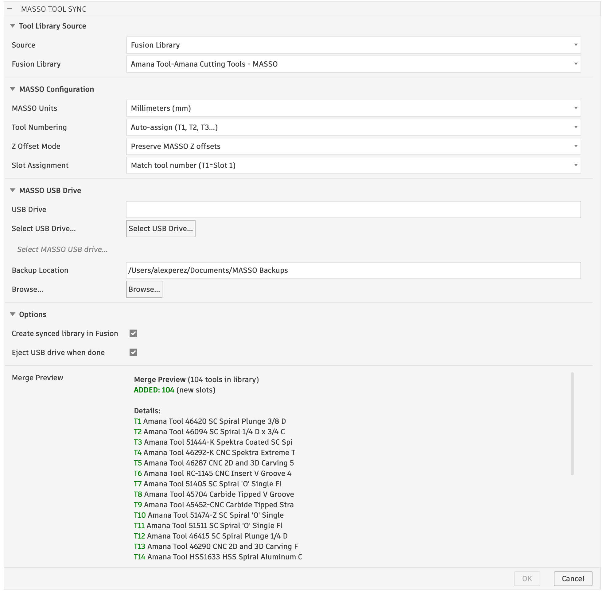

# MASSO Tool Sync

**Fusion 360 add-in that syncs tool libraries directly to your MASSO G3 CNC controller's USB drive.**

Version 0.1.0



## Features

- **One-click sync** from Fusion 360 tool libraries to MASSO G3 `.htg` tool table files
- **Direct USB write** — select your MASSO USB drive, and the add-in writes the tool table in place
- **Automatic backups** — zips the existing Machine Settings folder before every write
- **Auto-detect firmware** — finds the correct `.htg` filename on the USB automatically
- **Live merge preview** — see exactly what will change before committing
- **Smart merge** — preserves Z offsets from probed tools, detects added/updated/replaced/unchanged tools
- **Auto tool numbering** — assigns sequential T1-T100 numbers (MASSO's max; T101-T104 are reserved for multi-spindle heads) for manufacturer libraries that ship with all tools set to T1
- **Unit conversion** — automatically converts between inch and metric tool libraries
- **Fusion library sync** — optionally creates a MASSO-synced copy of the library in Fusion with updated tool numbers so posted G-code matches
- **Slot assignment** — configurable: match tool number or leave unassigned
- **Z offset modes** — zero all, preserve existing, or use Fusion body length
- **Auto-eject USB** — optionally ejects the USB drive when done (macOS)
- **Cross-platform** — works on macOS and Windows

## Installation

### Quick Install (Recommended)

**macOS:**
```bash
git clone https://github.com/percosys/Fusion-MassoToolSync.git
cd Fusion-MassoToolSync
./install.sh
```

**Windows:**
```cmd
git clone https://github.com/percosys/Fusion-MassoToolSync.git
cd Fusion-MassoToolSync
install.bat
```

### Manual Install

1. Download or clone this repository
2. Copy the `MassoToolSync/` folder (the inner one containing `MassoToolSync.py`) to your Fusion 360 Add-Ins directory:
   - **macOS:** `~/Library/Application Support/Autodesk/Autodesk Fusion 360/API/AddIns/`
   - **Windows:** `%APPDATA%\Autodesk\Autodesk Fusion 360\API\AddIns\`
3. Restart Fusion 360
4. Go to **Tools > Scripts and Add-Ins > Add-Ins** tab
5. Find **MassoToolSync** and click **Run**
6. Check **Run on Startup** if you want it to load automatically

## Usage

### Before You Start — Back Up Your MASSO Controller

Before using this add-in for the first time, create a backup of your MASSO controller settings to USB:

1. Insert a USB drive into the MASSO controller
2. On the MASSO touchscreen: **F1 Setup > Save & Load Calibration Settings > Save to file**
3. This creates the `MASSO/Machine Settings/` folder on the USB with your current tool table and machine settings
4. Keep this USB — the add-in will read from it, back it up automatically, and write the updated tool table to it

> **Important:** The add-in requires the `MASSO/Machine Settings/` folder structure on the USB. This is only created by the MASSO controller's "Save to file" function.

### 1. Open the Add-in

Navigate to **Manufacture > Milling** tab. You'll find the **MASSO Tool Sync** button in the **MASSO** panel on the toolbar. Click it to open the sync dialog.

The button is also available in the **Design** workspace under **Add-Ins**.

### 2. Select a Tool Library

Choose **Fusion Library** to pick from your local Fusion 360 tool libraries, or **File on Disk** to browse to a `.tools` or `.json` file.

### 3. Configure MASSO Settings

| Option | Description |
|--------|-------------|
| **MASSO Units** | Set to match your controller (mm or inches) |
| **Tool Numbering** | Auto-assign T1-T100 sequentially, or use the Fusion post-process numbers |
| **Z Offset Mode** | **Zero all** (safest, re-probe everything), **Preserve MASSO** (keep probed offsets), or **Use Fusion body length** (rough starting offset from tool geometry) |
| **Slot Assignment** | **Match tool number** (T1=Slot 1) or **Leave unassigned** (set manually on controller) |

### 4. Select MASSO USB Drive

Click **Select USB Drive** and browse to your MASSO USB drive. The add-in will look for the `MASSO/Machine Settings/` folder and show a status indicator:
- **Green** — Found existing tool table (will merge)
- **Orange** — No existing tool table (will create new)
- **Red** — MASSO folder structure not found

### 5. Review and Sync

The **Merge Preview** shows exactly what will happen:
- **ADDED** — new tools going into empty slots (Z=0, must probe)
- **UPDATED** — existing tools with changed diameter, Z offset, or slot
- **REPLACED** — different tool at the same slot number
- **UNCHANGED** — identical tools, no changes needed
- **SKIPPED** — tools that couldn't be assigned (overflow beyond T104, number 0, etc.)

Click **OK** to:
1. Back up the existing Machine Settings to a timestamped zip
2. Write the new tool table to the USB
3. Optionally create a synced Fusion library with updated tool numbers
4. Optionally eject the USB drive

### 6. Load on MASSO Controller

1. Plug the USB into your MASSO controller
2. **F1 Setup > Save & Load Calibration Settings > Load from file**
3. Reboot the MASSO controller
4. Probe Z on any new or changed tools

## Troubleshooting

**Add-in doesn't appear in toolbar:**
- Make sure you're in the **Manufacture** workspace, **Milling** tab
- Go to Scripts & Add-Ins (Shift+S), find MassoToolSync, click Run
- Check the **Run on Startup** checkbox for automatic loading

**"MASSO/Machine Settings/ not found" error:**
- Make sure you selected the USB drive root, not a subfolder
- The USB must contain a `MASSO/Machine Settings/` folder (created by the MASSO controller when you first back up settings)

**Tools show as blank on MASSO controller:**
- Make sure you loaded the file: F1 Setup > Save & Load Calibration Settings > Load from file
- Reboot the controller after loading

**CRC errors when reading USB file:**
- This can happen if the MASSO controller wrote tools with its own CRC variant. The add-in handles this automatically and preserves the original data.

**Preview doesn't update:**
- Try changing another dropdown to trigger a refresh
- If the issue persists, close and reopen the dialog

## Development

The add-in is built on the `fusion2masso` Python library which handles the binary `.htg` format, Fusion JSON parsing, and merge logic. The library is pure Python stdlib with no external dependencies.

### Project Structure

```
MassoToolSync/              # Fusion 360 add-in
  MassoToolSync.py          # Entry point (run/stop)
  MassoToolSync.manifest    # Fusion add-in manifest
  config.py                 # Configuration constants + VERSION
  command.py                # Dialog UI and handlers
  lib_browser.py            # Fusion CAM library enumeration
  event_utils.py            # Handler utility
  resources/                # Toolbar icons (16/32/64px)
  fusion2masso/             # Core library
    masso.py                # .htg binary reader/writer
    fusion.py               # Fusion .tools/.json parser
    mapping.py              # Merge logic
    fusion_sync.py          # Push libraries back to Fusion via adsk.cam
```

### Running Tests

The core library has a test suite:

```bash
pip install pytest
python -m pytest tests/ -v
```

### MASSO .htg Binary Format

The `.htg` file is 6720 bytes = 105 records of 64 bytes each. Record 0 is reserved (dry-run entry). Each record:

| Offset | Length | Type | Field |
|--------|--------|------|-------|
| 0 | 40 | ASCII | Tool name |
| 40 | 4 | float32 LE | Z offset |
| 44 | 8 | zeros | Reserved |
| 52 | 4 | float32 LE | Diameter |
| 56 | 2 | uint16 **BE** | Slot (0x00FF = empty) |
| 58 | 2 | zeros | Reserved |
| 60 | 4 | uint32 LE | CRC32 of bytes 0-59 |

## Acknowledgments

The MASSO `.htg` binary format was reverse-engineered with the help of the [MASSO community forum](https://forums.masso.com.au/threads/convert-cam-tool-libraries-into-masso-tool-file.4563/).

## License

This project is licensed under the GNU General Public License v3.0 — see the [LICENSE](LICENSE) file for details.
